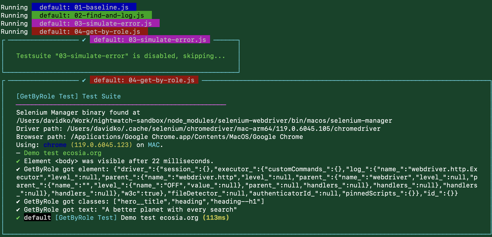

# Nightwatch Sandbox



## Prerequisites

1. [Node](https://nodejs.org/en/)
2. [Selenium Server](https://www.selenium.dev/downloads/)

## Setup

```shell
nvm use
npm i
```

## Run Tests

```
npm run start
```

## Development

To develop tests locally, follow these steps:

1. Serve the `index.html` page to run off of. This page exists so that a developer could have some simple HTML to run automation on.

```shell
# serve the html
npm run serve:html

# open in chrome
open -a "Google Chrome" "http://localhost:7310/"
```

2. Add the tag `dev` to a test you are working on

```ts
import 'nightwatch';
import { DescribeInstance } from 'nightwatch';

describe('Baseline Test', function (this: DescribeInstance) {
  this.disabled = false;
  this.tags = ['dev']; // tag here

  it('Demo test ecosia.org', async function (browser) {
    await browser.waitForElementVisible('body');
  });
});
```

3. Run the tests

```shell
npm run dev
```

## Debugging

```
npm run prestart
npx nightwatch dist/tests --config dist/nightwatch.conf.js
```

### Resources

1. https://github.com/kallaspriit/typescript-nightwatch-example
